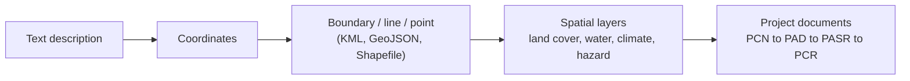

# Afternoon — Spatial Analysis & the eToolkit

**10 September 2026 · Session 3 and practical exercise · IsDB HQ Jeddah + Online**

---

## Recording

  <iframe width="100%" height="400"
    src="https://www.youtube.com/embed/9fgjHsIsvyU"
    title="GEIDA Foundation Level Batch 2 — Afternoon, 10 September 2026"
    frameborder="0"
    allow="accelerometer; autoplay; clipboard-write; encrypted-media; gyroscope; picture-in-picture"
    allowfullscreen>
  </iframe>

**Slide deck:** [:material-file-pdf-box: Deck 3 — Spatial analysis, the eToolkit and the GEIDA platform](https://expocitydubai-my.sharepoint.com/:b:/g/personal/sajid_pareeth_expocitydubai_ae/IQADp2_ROZXBQrnJVHq_OI9NAYABIXrKlUBZq58FLuRjVMU?e=JMFZza)

---

## Session 3 — Spatialising a project across the cycle

### The standardised boundary

Spatialising a project means converting the text description of where it is into spatial data that can be reused at every stage.

Once a project has a standardised boundary, the same geometry supports baseline preparation, appraisal maps, supervision during implementation and assessment at completion — which is what makes the evidence comparable over time.

### Analyses demonstrated

| Analysis | What it supports |
|---|---|
| Land cover and land use over the project area | Baseline description, change over time |
| Environmental and socio-economic context layers | Screening and design |
| Service area mapping | Which fields, settlements or users an intervention reaches |
| Buffers around infrastructure | Zones of influence along a canal, road or facility |
| Climate projections for the area | Risk context for appraisal |

---

## Practical exercise

### 1 — Digitising a project location in Google Earth

Using Google Earth Web, participants marked project locations and worked with the historical imagery slider to view the same site at different dates. Placemarks and drawn features can be edited after creation, and a project can be exported as a **KML file** for sharing with colleagues or importing into other tools.

### 2 — Administrative boundaries

Administrative boundaries for any country — national, regional, district level — can be downloaded from [GADM](https://gadm.org) in common vector formats including GeoJSON, without any software installation. Participants selected a district boundary and carried it forward as a layer.

### 3 — Spatial analysis in GeoLibre

[GeoLibre](https://viewer.geolibre.app) runs in the browser and performs spatial operations that would otherwise need desktop GIS. In the demonstration participants imported digitised locations, selected administrative units, created new layers from a selection, ran buffer operations, and exported results — including as a standalone HTML map that can be shared with colleagues and opened as an interactive map without any GIS software.

### 4 — Reporting in the eToolkit

The [eToolkit](https://etoolkit.terrawatch.net) generates an EO analysis report for a defined area. The workflow is:

1. Select the project theme and project-cycle phase
2. Define the area of interest — draw it on the map, or upload the boundary prepared earlier
3. Explore the map, overlay data layers, switch base maps and adjust the visualisation
4. Run the analysis using satellite-derived datasets
5. Download the generated report

!!! note "eToolkit access"
    Continue to use the credentials issued to you before the in-person day. If you no longer have them, contact the GEIDA Programme team.

### 5 — Project information template

Participants were asked to complete the project information template with the project code, name, country, sector, project-cycle stage, location and the Earth Observation or geoinformatics question they want addressed, adding any existing project maps. Details are submitted through the [Project Data Submission Form](https://forms.cloud.microsoft/Pages/ResponsePage.aspx?id=CA8x2HQVG0eId0PFAyJbGrgFJg6wpgZJskdpEwAADllUNU9ZNzVJSFUwUFJDSkJINTFRTjYxT0hZTy4u). This carries forward into the [Part 3 online sessions](part-3.md), where each participant develops their project into an applied case.

---

## Closing and certificates

The day closed within the wider Boot Camp programme, with remarks on the joint accountability framework across the Operations Complex and the presentation of certificates to participants who completed the geospatial training.

---

*Continue to [Part 3 — Online Practical Follow-up](part-3.md)*
