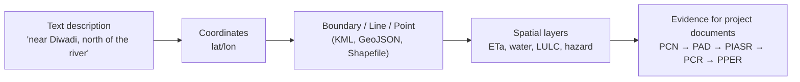

# Morning — Why EO Matters & Fundamentals

**Day 1 · 09:30–12:30 · Module 1 · Sessions 1 & 2**

---

## Session 1 — Why Geoinformatics Matters *(09:30–10:30)*

  <iframe width="100%" height="400"
    src="https://www.youtube.com/embed/OUn-SUxMe8Y"
    title="Why Geoinformatics Matters — GEIDA Foundation Training Day 1"
    frameborder="0"
    allow="accelerometer; autoplay; clipboard-write; encrypted-media; gyroscope; picture-in-picture"
    allowfullscreen>
  </iframe>

**Slide deck:** [:material-file-pdf-box: Day 1 Deck 1 — Why Geoinformatics Matters](../assets/slides/Day1_Deck1_Why_Geoinformatics.pdf)

---

### The spatial evidence gap

IsDB finances projects across dozens of member countries every year — agriculture schemes, water networks, road corridors, schools, health centres. Every project has a location. Many project appraisal documents, however, lack a spatial baseline.

Without a spatial baseline, the absence of spatially referenced data can limit IsDB's ability to:

- Verify that a site was well chosen relative to landscape conditions and risk factors
- Monitor physical change remotely during implementation
- Produce comparable evidence at project completion
- Support independent evaluation of what actually changed on the ground

EO analysis complements rather than replaces field observations, engineering records, environmental safeguards assessments, and stakeholder engagement. The evidence base for a project document should draw on all of these.

| | Without spatial evidence | With spatial evidence |
|---|---|---|
| **Location description** | Text paragraph, no coordinates | Project boundary mapped, land cover classified, infrastructure marked |
| **Progress** | Narrative only | Satellite-derived construction progress assessment |
| **Indicators** | Generic table | Quantified change in actual evapotranspiration (ETa) or irrigated area — traceable and repeatable |

---

### How peer institutions use geospatial information

Peer institutions in development finance use geospatial information in several complementary ways: geocoding and mapping project portfolios; project identification, site screening and appraisal; environmental and climate-risk screening; remote supervision and field-data collection; monitoring physical outputs and spatial outcomes; impact evaluation and learning; open-data publication and portfolio transparency; and internal geospatial services, platforms and capacity development.

The table below summarises verified initiatives from peer institutions and programmes:

| Institution / Programme | Initiative or Platform | Operational Relevance | Source |
|---|---|---|---|
| World Bank | World Bank Maps / Geospatial Platform | Spatial interface for exploring projects and datasets by geography and sector | [maps.worldbank.org](https://maps.worldbank.org/) |
| World Bank | GeoLab | Supports geospatial analysis, imagery processing, application development, capacity building and enterprise tools | [worldbank.org/en/programs/geo-lab](https://www.worldbank.org/en/programs/geo-lab) |
| World Bank | GEMS — Geo-Enabling Initiative for Monitoring and Supervision | Field-appropriate digital data collection, monitoring, supervision and risk management, with strong application in fragile and conflict-affected settings | [worldbank.org — GEMS](https://www.worldbank.org/en/topic/fragilityconflictviolence/brief/geo-enabling-initiative-for-monitoring-and-supervision-gems) |
| ESA / IFIs | Global Development Assistance (GDA) programme | Supports mainstreaming of Earth Observation in development operations; thematic coverage, tools, knowledge support, capacity building and integration with IFI operations | [gda.esa.int](https://gda.esa.int/) |
| Asian Development Bank | EO Services and Tools for Development | Applications in infrastructure planning, agriculture, coastal management, disaster risk and environmental assessment | [adb.org](https://www.adb.org/publications/earth-observation-services-tools-development-examples-indonesia) |
| IFAD | GIS and remote sensing in impact assessment | Geospatial and time-series EO data for rural project targeting, environmental outcome measurement and impact assessment | [ifad.org — GIS note](https://www.ifad.org/ifad-impact-assessment-report-2021/assets/pdf/GIS-note.pdf) |
| African Development Bank | MapAfrica | Geocoded portfolio-transparency platform for exploring projects by geography, sector and approval year | [afdb.org — MapAfrica](https://www.afdb.org/en/projects-and-operations/mapafrica) |
| Inter-American Development Bank | IDB Atlas | Institutional GIS environment for mapping, analysis, visualisation, dashboards and field data collection | [atlas.iadb.org](https://atlas.iadb.org/) |
| Adaptation Fund / ESA | Satellite EO collaboration | Partnership to strengthen climate adaptation projects through satellite Earth Observation | [adaptation-fund.org](https://www.adaptation-fund.org/european-space-agency-and-adaptation-fund-collaborate-to-strengthen-global-climate-adaptation-projects-through-satellite-earth-observation-technology/) |

The strongest institutional models combine project geocoding, data governance, reusable analytical services, links to project-cycle decisions, capacity development and appropriate field validation. GEIDA positions IsDB to develop comparable capabilities progressively.

---

### The demand signal from IsDB staff

106 staff registered for Batch 1 before training dates were finalised:

| Statistic | Figure |
|---|---|
| Total registered | **106** IsDB staff |
| No prior GIS/EO experience | **51%** |
| Basic or below (combined) | **90%** |
| Want both Foundation and Advanced | **65%** |

Registration spanned operations, evaluation, climate, IT, and management — Regional Hubs (34), CCD (11), ESID (10), IEvD (9), STF (7).

---

## Session 2 — Fundamentals of Earth Observation & Geoinformatics *(11:00–12:30)*

  <iframe width="100%" height="400"
    src="https://www.youtube.com/embed/YkiJSeGxfVQ"
    title="Fundamentals of Earth Observation & Geoinformatics — GEIDA Foundation Training Day 1"
    frameborder="0"
    allow="accelerometer; autoplay; clipboard-write; encrypted-media; gyroscope; picture-in-picture"
    allowfullscreen>
  </iframe>

**Slide deck:** [:material-file-pdf-box: Day 1 Deck 2 — EO Fundamentals](../assets/slides/Day1_Deck2_EO_Fundamentals.pdf)

---

### What is Earth Observation?

Earth Observation (EO) means gathering information about the Earth's surface from a distance — using satellites, aircraft, or drones. The underlying principle: the sun's energy reflects off the surface, sensors measure the returning signal, and different surface types return different spectral signatures.

A satellite image is not a photograph. It is a grid of pixels, each carrying a measured value. Spectral bands beyond red-green-blue — near-infrared, shortwave infrared — reveal vegetation health, soil moisture, and surface temperature that are not visible to the human eye.

### Types of satellite data

=== "Optical (Sentinel-2, Landsat)"

    Records reflected sunlight. Provides visible colour plus invisible spectral bands. Well-suited for vegetation mapping, water body detection, and land cover classification. **Cannot see through cloud cover or capture imagery at night.**

    - **Sentinel-2** — EU/ESA — 10 m spatial resolution, approximately 5-day revisit under cloud-free conditions, 13 spectral bands, freely available
    - **Landsat** — USGS/NASA — 30 m resolution, 16-day revisit, archive extending over 40 years, freely available

    !!! note "Revisit vs availability"
        Nominal revisit periods assume cloud-free conditions. Actual usable imagery frequency is lower in persistently cloudy or humid regions. Always check the data availability for your specific area and season before committing to analysis dates.

=== "Radar (Sentinel-1)"

    Transmits its own microwave signal and records the backscattered return. Operates through cloud cover and in darkness. Used for surface water and flood mapping, surface deformation monitoring, and vegetation structure characterisation.

    - **Sentinel-1** — EU/ESA — 10 m spatial resolution, approximately 6-day revisit, freely available

=== "Nighttime Light (VIIRS)"

    Records light emitted at night from artificial sources. Used as an indirect proxy for human activity, electrification extent, and economic activity at broad scales.

    !!! warning "Limitations of nighttime-light data"
        Nighttime-light measurements are an indirect proxy only. Observed values are affected by sensor characteristics, temporal calibration differences between satellite generations, blooming effects (light spreading beyond true source areas), seasonal variation (snow reflectance, vegetation phenology), and atmospheric conditions. Nighttime-light data can support portfolio-level screening and contextual analysis but does not replace project-specific output indicators or field-verified electrification surveys.

### Geoinformatics and spatial data types

**Geoinformatics** is the discipline of collecting, storing, analysing, and presenting location-based information. Spatial data comes in two forms:

- **Vector** — discrete features represented by geometry and attributes:
    - **Points** — a well, a school, a clinic
    - **Lines** — a road, a canal, a pipeline
    - **Polygons** — a project boundary, an irrigation command area, a catchment

- **Raster** — a grid of values covering an area (a satellite image, a rainfall map, a digital elevation model)

### The three resolutions

Every EO dataset involves three trade-offs:

| Resolution type | What it means | Example |
|---|---|---|
| **Spatial** | Ground area per pixel — level of spatial detail | Sentinel-2 = 10 m per pixel |
| **Temporal** | How frequently a new observation is acquired | Sentinel-2 nominal revisit every 5 days |
| **Spectral** | Number of bands — range of phenomena distinguishable | Sentinel-2 = 13 spectral bands |

!!! note "Open access and open use"
    Most data used in this training is freely accessible: Copernicus/Sentinel (EU), Landsat (USGS/NASA), and the platforms that package them — eToolkit, WaPOR, EarthMap, GeoLibre. Open access means freely downloadable; open use conditions vary by dataset and intended application — check licence terms for formal project documentation.

### Spatialising an IsDB project

"Spatialising" a project means converting the text description of where it is into actual spatial data — so it can be screened, monitored, and evaluated with EO.

Once spatial, a project can establish a baseline, include standard maps in its PCN, PAD, or RRM, be monitored remotely during implementation, and have its outcomes assessed at completion — all using the same boundary. Satellite-derived indicators provide one line of evidence; they should be contextualised against field data, engineering records, and programme knowledge.

---

*Continue to [Afternoon — Mainstreaming EO & Exercise 1](afternoon.md)*
