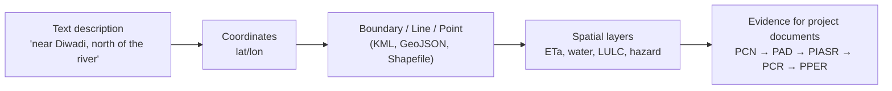

# Morning — Why EO Matters & Fundamentals

**Day 1 · 09:30–12:30 · Module 1 · Sessions 1 & 2**

---

## Session 1 — Why Geoinformatics Matters *(09:30–10:30)*

  <iframe width="100%" height="400"
    src="https://www.youtube.com/embed/OUn-SUxMe8Y"
    title="Why Geoinformatics Matters — GEIDA Foundation Training Day 1"
    frameborder="0"
    allow="accelerometer; autoplay; clipboard-write; encrypted-media; gyroscope; picture-in-picture"
    allowfullscreen>
  </iframe>

**Slide deck:** [:material-file-pdf-box: Day 1 Deck 1 — Why Geoinformatics Matters](../assets/slides/Day1_Deck1_Why_Geoinformatics.pdf)

---

### The spatial evidence gap

Dr Sajid opened by setting the scene: IsDB finances projects across dozens of member countries every year — agriculture schemes, water networks, road corridors, schools, health centres. Every project has a location. Almost none has a spatial baseline in its appraisal document.

> "Think of the last project report you read. Did it include a single map?" — Dr Sajid Pareeth

Without a spatial baseline, IsDB cannot:

- Verify that a site was well chosen
- Monitor physical change remotely during implementation
- Produce comparable evidence at completion
- Evaluate independently what actually changed

| | Without spatial evidence | With spatial evidence |
|---|---|---|
| **Location description** | Text paragraph, no coordinates | Project boundary mapped, land cover classified, infrastructure marked |
| **Progress** | Narrative only | Satellite-verified construction progress |
| **Indicators** | Generic table | ETa change +18% · irrigated area +2,300 ha — verifiable and repeatable |

### How peer development banks are moving

**ESA Geodata for Development (GDA)** — 110+ EO case studies across 72 countries since 2021. Topics: climate risk, land/water use, infrastructure. An open MOOC provides ready-made use cases. See the [ESA GDA tutorials](../resources/tutorials.md#esa-geodata-for-development-gda-programme).

**IFAD** — geospatial strategy 2022–2025 mandates spatial baselines in all new rural investment projects. EO-derived indicators (ETa, LULC) used as outcome variables in impact assessments.

**World Bank** — Global Environmental Monitoring System (GEMS) and nighttime-lights data track electrification, urban growth, and conflict impact at country scale, cited in every Country Partnership Framework.

### The demand signal from IsDB staff

106 staff registered for Batch 1 before a single training date was announced:

| Statistic | Figure |
|---|---|
| Total registered | **106** IsDB staff |
| No prior GIS/EO experience | **51%** |
| Basic or below (combined) | **90%** |
| Want both Foundation and Advanced | **65%** |

Registration spanned operations, evaluation, climate, IT, and management — Regional Hubs (34), CCD (11), ESID (10), IEvD (9), STF (7).

---

## Session 2 — Fundamentals of Earth Observation & Geoinformatics *(11:00–12:30)*

  <iframe width="100%" height="400"
    src="https://www.youtube.com/embed/YkiJSeGxfVQ"
    title="Fundamentals of Earth Observation & Geoinformatics — GEIDA Foundation Training Day 1"
    frameborder="0"
    allow="accelerometer; autoplay; clipboard-write; encrypted-media; gyroscope; picture-in-picture"
    allowfullscreen>
  </iframe>

**Slide deck:** [:material-file-pdf-box: Day 1 Deck 2 — EO Fundamentals](../assets/slides/Day1_Deck2_EO_Fundamentals.pdf)

---

### What is Earth Observation?

Earth Observation (EO) means gathering information about the Earth's surface from a distance — using satellites, aircraft, or drones. The basic physics: the sun's energy reflects off the surface, sensors measure what comes back, and different surfaces return different signals.

A satellite image is not a photograph. It is a grid of pixels, each carrying a measured value. Bands beyond red-green-blue — near-infrared, shortwave infrared — reveal vegetation health, soil moisture, and surface temperature.

### Types of satellite data

=== "Optical (Sentinel-2, Landsat)"

    Records reflected sunlight. Provides colour plus invisible bands. Excellent for vegetation, water, and land cover. **Cannot see through cloud or at night.**

    - **Sentinel-2** — EU/ESA — 10 m resolution, 5-day revisit, 13 bands, free
    - **Landsat** — USGS/NASA — 30 m resolution, 16-day revisit, 40+ year archive, free

=== "Radar (Sentinel-1)"

    Sends its own microwave signal and records what bounces back. Works through cloud, works at night. Used for water/flood mapping and surface change detection.

    - **Sentinel-1** — EU/ESA — 10 m resolution, 6-day revisit, free

=== "Nighttime Lights (VIIRS)"

    Records light emitted at night. Proxy for human activity, electrification, and economic development. Used for portfolio-level monitoring across member countries.

### Geoinformatics and spatial data types

**Geoinformatics** is the discipline of collecting, storing, analysing, and presenting location-based information. Spatial data comes in two forms:

- **Vector** — discrete features with locations:
    - **Points** — a well, a school, a clinic
    - **Lines** — a road, a canal, a pipeline
    - **Polygons** — a project boundary, an irrigation command area, a catchment

- **Raster** — a grid of values covering an area (a satellite image, a rainfall map, an elevation model)

### The three resolutions

Every EO dataset involves three trade-offs:

| Resolution type | What it means | Example |
|---|---|---|
| **Spatial** | Ground area per pixel — level of detail | Sentinel-2 = 10 m per pixel |
| **Temporal** | How often a fresh image is captured | Sentinel-2 revisits every 5 days |
| **Spectral** | How many bands — how many things you can distinguish | Sentinel-2 = 13 bands |

!!! note "The open-data commitment"
    All data in this training is free to access and use: Copernicus/Sentinel (EU), Landsat (USGS/NASA), and the platforms that package them — eToolkit, WaPOR, EarthMap, GeoLibre. Reproducible by any participant, operationalisable by IsDB at no per-use cost.

### Spatializing an IsDB project

"Spatializing" a project means converting the text description of where it is into actual spatial data — so it can be screened, monitored, and evaluated with EO.

Once spatial, a project can establish a baseline, get standard maps in its PCN/PAD/RRM, be monitored remotely during implementation, and have its outcomes verified at completion — all using the same boundary.

---

*Continue to [Afternoon — Mainstreaming EO & Exercise 1](afternoon.md)*
