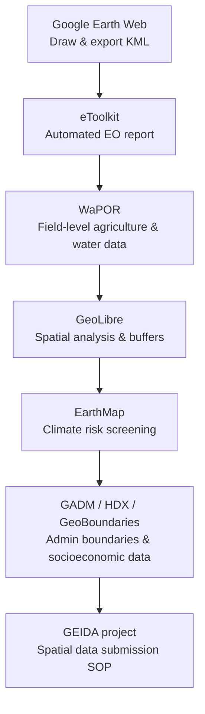

# Afternoon — Group Presentations & Closing

**Day 4 · 13:30–16:00 · Module 5**

---

## Group Presentations on Case-Study Findings *(13:30–15:00)*

  <iframe width="100%" height="400"
    src="https://www.youtube.com/embed/NX0-uz27qcE"
    title="Group discussion on case-study results — Day 4 afternoon"
    frameborder="0"
    allow="accelerometer; autoplay; clipboard-write; encrypted-media; gyroscope; picture-in-picture"
    allowfullscreen>
  </iframe>

---

Groups presented their case-study maps, eToolkit outputs, and climate risk analyses. Below are key themes and examples from the session.

### Example presentation — road project, Kagere/Issyquil region

One group from the Independent Evaluation Department presented an analysis of an IsDB-financed road reconstruction project:

**What they did:**

- Mapped the road corridor with start and end coordinates
- Drew a 1 km buffer around the financed road section
- Generated an eToolkit analysis for the corridor: LULC, vegetation, climate projections
- Used the AI recommendation from eToolkit as the basis for design recommendations

**Their findings:**

- Temperature is elevating in the region (eToolkit climate data)
- Precipitation is fluctuating — more variable, not uniformly increasing or decreasing
- Dominant land cover: grasslands — identified as vulnerable to erosion risk at road embankments
- Asphalt surfaces will accelerate soil erosion at embankment edges under increased rainfall

**Their recommendation:**

> "High-resilient, climate change adaptive infrastructure to mitigate flooding and aridification. Build wider culverts. Use erosion-resistant embankment design." — Group 1, Day 4

**Feedback from Dr Sajid:**

- The AI recommendations and numbers (e.g. 1.5°C, 49% variability) are based on actual satellite-derived climate data — not generated by AI. The AI only writes the recommendation text based on real numbers.
- Map legend: don't let the legend cover the project boundary — leave clear space; the boundary is your study area and must be fully visible
- The ISDB logo was successfully added — "I'm surprised!" — shows good awareness of document standards
- Good instinct from participants asking about population in the buffer zone — EarthMap can provide this for future analyses

### Common feedback themes from all groups

| Theme | Guidance |
|---|---|
| Map layout | Legend should not cover the study area; leave margin between legend and map |
| AI text | Numbers are from satellite data; AI only writes the interpretation text |
| GeoLibre for roads | Use buffer + population raster for beneficiary estimation |
| Climate projections | Specific % changes and °C values come from processed satellite/climate model data — cite them as EO evidence |
| EarthMap | Best for national/basin-scale risk overview; combine with eToolkit for site-level detail |

---

## Wrap-up, Lessons Learned & Way Forward *(15:00–15:30)*

### Key messages from Dr Sajid

- **Foundation is just the start.** The Advanced level will go deeper into project-specific analysis, more tools, and more complex indicators.
- **Register projects spatially from PCN stage.** The Minimum Project Data Submission Form is the beginning of the GEIDA SOP — start collecting spatial data from the moment a project is identified.
- **Web tools are a gateway, not the ceiling.** eToolkit, WaPOR, GeoLibre, and EarthMap are sufficient for Foundation-level work. For participants who want to go further: download QGIS — it is free and the natural next step.
- **Regional GEIDA Meetings** are planned — use the Regional Meeting Nomination Form to be part of them.

### What the Foundation course covered

In four days, participants went from no GIS experience to being able to:

No desktop software. No coding. All web-based.

---

## Closing Remarks & Certificate Distribution *(15:30–16:00)*

  <iframe width="100%" height="400"
    src="https://www.youtube.com/embed/W3TiYI05k9I"
    title="GEIDA Foundation Training — Closing session"
    frameborder="0"
    allow="accelerometer; autoplay; clipboard-write; encrypted-media; gyroscope; picture-in-picture"
    allowfullscreen>
  </iframe>

The CCD/STI Manager gave the closing remarks, encouraging participants to apply the skills in their next project document and to support colleagues in their departments.

**Next steps:**

- Advanced Level training — follow-on from Foundation
- Regional GEIDA Meetings — nomination forms to be submitted
- GEIDA platform development continues — participant feedback and use-case forms will inform the next development phase
- Foundation Level Certificates distributed to all participants who completed the four days

!!! success "Congratulations to all Batch 1 participants!"
    You are now GEIDA Foundation Level certified. Apply it in your next PCN or PAD. Every project has a location — now you have the tools to work with it.

---

*Return to [Home](../index.md) · View [Resources & Tutorials](../resources/index.md)*
