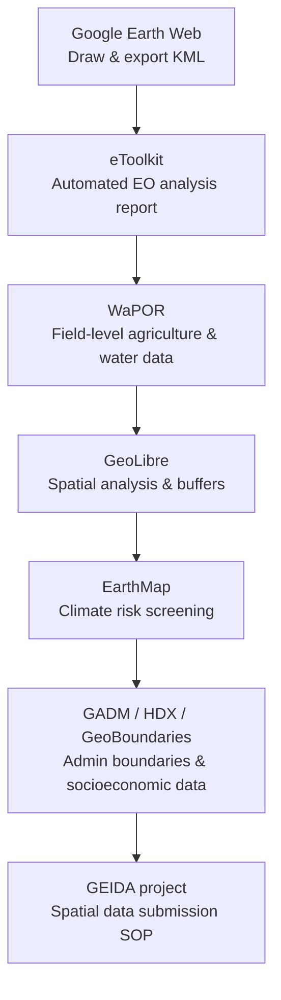

# Afternoon — Group Presentations & Closing

**Day 4 · 13:30–16:00 · Module 5**

---

## Group Presentations on Case-Study Findings *(13:30–15:00)*

  <iframe width="100%" height="400"
    src="https://www.youtube.com/embed/NX0-uz27qcE"
    title="Group discussion on case-study results — Day 4 afternoon"
    frameborder="0"
    allow="accelerometer; autoplay; clipboard-write; encrypted-media; gyroscope; picture-in-picture"
    allowfullscreen>
  </iframe>

The afternoon session brought together five presentations in which participants applied the tools introduced during the training to real or representative development-project questions. Presenting groups drew on a combination of eToolkit, GeoLibre, EarthMap and other platforms to produce spatial analyses, biophysical assessments and climate-risk screenings. A Regional Hub participant also contributed a case study conducted independently during the training.

### Summary table

| Presentation | Sector and case-study context | Topics covered | Tools and evidence |
|---|---|---|---|
| Road reconstruction and climate resilience | Transport — climate resilience of a reconstructed road segment | Temperature trends, precipitation variability, flood and aridity exposure, grassland cover, erosion risk, culvert and drainage design | eToolkit (climate projections, land cover, AI narrative) |
| Long road corridor — accessibility, settlement and land-cover change | Transport — approximately 131 km road corridor with a 2 km buffer | Population and density trends, built-up area change, cropland expansion, forest-cover loss, market access, flood exposure | GeoLibre (digitising and buffering), EarthMap (population, land cover), Dynamic World |
| Completed road project evaluation in The Gambia | Transport — evaluation of an approximately 13.5 km completed road | Built-up area change, settlement-pattern change, rural–suburban–urban classification, baseline selection | Dynamic World (land cover), Global Human Settlement Layer / JRC (settlement classification) |
| Agricultural farm assessment in Saudi Arabia | Agriculture — biophysical, climatic and hydrological assessment of a large farm | Cropland cover, rainfall variability, evapotranspiration, groundwater trends, temperature and aridity, soil condition, sustainability | eToolkit, EarthMap, GeoLibre; quality-control exercise on boundary verification |
| Uganda Regional Hub participant case study — proposed irrigation development in Somalia | Agriculture / water — preliminary site screening for a proposed irrigation-development area | Vegetation and rangeland cover, rainfall, evapotranspiration, groundwater, terrain and slope, surface-water availability | Google Earth, GeoLibre, eToolkit |

---

### Case study 1 — Road reconstruction and climate resilience

#### Overview

This presentation examined the climate-resilience implications for a reconstructed road segment financed by IsDB. The group mapped the road using start and end coordinates and defined a 1 km analysis buffer around the financed portion.

!!! note "Location"
    Road and regional names as transcribed from the recording are unreliable. The analysis is presented without confirmed place names. Verify the country, road name and region from the relevant project documentation before referencing this case study in formal reporting.

#### Approach and evidence

The analysis was conducted in eToolkit, which generated a report covering current land-use and land-cover classification, climate trends and projections, and AI-generated recommendations. The infrastructure sector was selected, and the project corridor was entered as the area of interest.

#### Key observations

- Temperature trends in the region indicated an upward trajectory based on climate-model projections processed by eToolkit. Projected warming values are modelled estimates, not direct satellite measurements.
- Precipitation was projected to be variable, with no uniform trend towards increase or decrease.
- The dominant land cover was classified as grassland. Grassland cover along road embankments may be associated with increased surface erosion risk under high-rainfall events, particularly where drainage design is inadequate.
- Asphalt surfaces can accelerate surface runoff, which may intensify soil erosion at embankment edges if not managed through appropriate drainage and slope protection.

!!! note "On AI-generated text in eToolkit"
    The quantitative values in eToolkit reports — projected temperature change, precipitation variability, land-cover percentages — are derived from satellite-derived and climate-model datasets processed by the platform. The interpretation text is generated by an AI model. These two components should be treated separately: the underlying indicator values merit review against their source datasets; the AI narrative is a draft interpretation that requires expert review before use in project documentation.

#### Recommendations

Design recommendations identified through the analysis included:

- Road elevation or flood protection measures where the corridor passes through flood-exposed areas.
- Adequately sized culverts to accommodate projected precipitation variability.
- Erosion-resistant embankment surfaces and revegetation where grassland conversion may increase runoff.
- Drainage and climate-adaptation measures incorporated into the construction specification.

#### Limitations and follow-up

- The analysis buffer and study area should remain visible in the map without being obscured by the legend or other cartographic elements.
- Climate projections represent ensemble-modelled estimates for a broad area; site-specific hydrological and geotechnical studies would be required to translate these into engineering specifications.
- AI-generated recommendations require expert interpretation in the context of specific road standards, local soil conditions and hydrological data.

---

### Case study 2 — Long road corridor: accessibility, settlement and land-cover change

#### Overview

This presentation assessed an approximately 131 km road corridor using a 2 km buffer. The analysis focused on spatial trends in population, settlement, land cover and flood exposure along the corridor.

!!! note "Location"
    Road and place names as transcribed from the recording could not be reliably verified. Confirm them from project documentation before use in formal materials.

#### Approach and evidence

The workflow involved digitising the road as a line feature in GeoLibre, creating a corridor buffer, exporting the buffer as a GeoJSON file, and uploading it to EarthMap and related platforms to extract population, settlement and land-cover information. This demonstrated effective tool combination: GeoLibre for spatial definition and buffer creation, and EarthMap for indicator extraction.

#### Key observations

- Population within the corridor buffer appeared to have grown over the study period, with population-density trends indicating increasing concentration along the road.
- Built-up area showed an increase consistent with settlement expansion.
- Land-cover analysis indicated substantial cropland expansion and a corresponding decline in forest cover within the buffer. The reported scale of change requires validation with historical imagery before being cited in formal documentation.
- Flood-prone areas and potential waterlogging were identified along sections of the corridor.

!!! warning "Spatial association is not causal attribution"
    Population growth, agricultural expansion and forest-cover change observed within the road corridor may be spatially associated with road access, but cannot be attributed to the road alone without controlling for other factors — demographic trends, agricultural investment, land-tenure changes and market development. These findings are preliminary spatial observations, not impact-assessment conclusions.

#### Recommendations and follow-up

- Verify apparent cropland expansion and forest-cover loss using historical satellite imagery before citing percentage figures.
- Investigate flood-prone road sections to identify drainage constraints requiring engineering attention.
- Examine selected locations at a more appropriate scale rather than relying solely on corridor-wide summary statistics.
- Cite the source dataset for each indicator, not only the platform through which it was accessed.
- Avoid false precision in percentage-change results; use order-of-magnitude language where the data do not support exact figures.
- Combine EO-derived evidence with project records, field observations and socioeconomic information before drawing conclusions about project contribution.

---

### Case study 3 — Completed road project evaluation in The Gambia

#### Overview

This presentation re-examined a completed IsDB-financed road approximately 13.5 km in length in The Gambia, completed in 2021, with an objective of improving connectivity, reducing travel time and enhancing access for peri-urban and agricultural communities. The group explored whether spatial indicators could corroborate findings from a formal evaluation.

#### Approach and evidence

A buffer zone was defined around the project corridor. Two main datasets were used:

- **Land-cover change** using Dynamic World, a deep-learning-based land-cover product at 10 m resolution from Sentinel-2 imagery, produced in partnership between Google and ESRI.
- **Settlement classification** using the Global Human Settlement Layer (GHS-SMOD), produced by the Joint Research Centre (JRC) of the European Commission. This product classifies grid cells by settlement type — rural, suburban/peri-urban, urban centre — with time-series data available from 2015.

#### Key observations

- Built-up area within the buffer zone showed a general increase over the study period.
- The GHS settlement classification indicated that the predominant pattern of change was growth in suburban and peri-urban classification, with limited change in the urban-centre category.
- One anomalous annual result showed an apparent decline in built-up area, noted as inconsistent with the overall trend and likely reflecting a data artefact.

!!! warning "Data reliability and baseline selection"
    An anomalous annual value may reflect cloud contamination of Sentinel-2 imagery, classification errors in the deep-learning model, or limited cloud-free observations in that year. Single-year comparisons are more susceptible to such artefacts than multi-year composites. Using the project completion year as the pre-project baseline was identified as methodologically problematic: construction effects and associated development activity typically begin before a road's formal completion date. A baseline dated to 2016–2018 would have been more appropriate for this case.

#### Recommendations and analytical lessons

- Use multi-year composites or averaged annual results rather than single-year snapshots.
- Select a pre-project baseline that pre-dates construction sufficiently; the completion date is not an appropriate reference point.
- Validate anomalous values against historical imagery before including them in formal reporting.
- Settlement and built-up area increases may be consistent with improved road access but do not prove that the road caused the observed development.
- Reference the originating dataset (GHS-SMOD, Dynamic World) and its methodology directly, not only the platform used to access it.
- Global land-cover products derived from deep learning have known limitations in rapidly changing areas; field validation and cross-reference with evaluation evidence remain essential.

---

### Case study 4 — Agricultural farm assessment in Saudi Arabia

#### Overview

This presentation examined the biophysical, climatic and hydrological conditions of a large agricultural farm in Saudi Arabia, drawing on multiple spatial datasets to assess the suitability and sustainability of continued production.

#### Approach and evidence

The group combined eToolkit outputs, EarthMap and GeoLibre to produce an integrated assessment covering land cover, precipitation, evapotranspiration, groundwater trends, temperature projections and soil condition. The workflow included uploading a farm boundary file and generating analysis reports from multiple platforms.

#### Key observations

- Land-cover analysis indicated dominance of cropland, with additional areas of sparse vegetation and potentially degraded land.
- Rainfall data showed high interannual variability, characteristic of the arid and semi-arid environment in which the farm is located.
- Evapotranspiration substantially exceeded average annual rainfall, indicating a persistent water deficit and dependence on groundwater or supplementary irrigation.
- Groundwater level indicators suggested declining trends, consistent with extraction in excess of recharge rates.
- Temperature projections indicated continued warming and increased aridity.

!!! warning "Quality-control lesson: verify the area of interest before interpreting results"
    During this exercise, the group identified that an initial analysis had inadvertently been run for the wrong geographic extent — a different country was processed rather than the intended farm location, and the platform did not automatically alert the user. This illustrates a critical quality-control step: **always verify the area-of-interest boundary, geographic location, map extent and scale, input file geometry, analysis period, units and indicator definitions before interpreting results.** Verification should be the first step of any spatial analysis workflow.

#### Recommendations

- Improved water management, including infrastructure for rainwater or surface-runoff harvesting where hydrologically appropriate; feasibility must be assessed against local rainfall volumes, catchment characteristics and storage capacity.
- Efficient irrigation systems to minimise water loss and apply water directly to root zones.
- Soil management and conservation measures to address land degradation.
- Introduction of drought-tolerant or water-efficient crop varieties.
- Capacity development for farm operators on water-efficient practices and soil conservation.

#### Limitations and follow-up

- AI-generated recommendations must be reviewed against the local context. In an arid desert environment, recommendations such as rainwater harvesting require hydrological and engineering assessment to establish feasibility.
- Global land-cover products may misclassify large-scale mechanised or pivot-irrigated agriculture in arid settings. On-site validation or higher-resolution imagery is advisable.
- Satellite-derived groundwater indicators are modelled products with significant uncertainty at farm scale; national or basin-level groundwater monitoring data should be consulted alongside them.

---

### Uganda Regional Hub participant case study — proposed irrigation development in Somalia

#### Overview

A participant joining from the Uganda Regional Hub presented a preliminary site-screening analysis for a proposed irrigation-development project in Somalia. The analysis applied tools introduced during the training to an active project-preparation context. The presentation was informal rather than a prepared slide deck; the findings are summarised below from the participant's account.

!!! note "Location"
    The proposed project location was described as a district in Somalia. The district name as recorded could not be reliably verified and is not reproduced here. The site is referred to as "a proposed irrigation-development area in Somalia". Verify the exact location from project documentation before including it in formal materials.

#### Approach and evidence

The participant used Google Earth, GeoLibre and eToolkit to assess the site environment, drawing on land-cover, vegetation, rainfall, evapotranspiration, terrain and groundwater datasets available through these platforms.

#### Key observations

- Vegetation cover was sparse, with the area characterised as predominantly rangeland. No clear evidence of existing rain-fed agricultural production was identified within the study area.
- Land-use patterns indicated some urban expansion in the vicinity, with rangeland use remaining dominant.
- Rainfall data showed low and highly variable precipitation. The period 2020–2022 was notably dry, with limited recovery in subsequent years.
- Temperatures were high and conditions semi-arid.
- Evapotranspiration analysis indicated a persistent water deficit.
- Terrain analysis suggested relatively flat to gently sloping topography, which would be compatible with surface irrigation infrastructure in principle.
- Surface-water availability appeared limited and unreliable.

#### Recommendations

The following investigative steps were identified as necessary before a project decision could be made:

- Detailed groundwater investigation to assess aquifer depth, yield and extent.
- Groundwater quality testing to confirm suitability for irrigation use.
- Assessment of sustainable abstraction potential, including seasonal variability and recharge rates.
- Verification of alternative surface-water sources.
- Soil and agronomic assessment to evaluate crop suitability and production potential.
- Preparation of a more complete project-level spatial analysis integrating EO findings with hydrogeological and engineering investigations.

#### Limitations and follow-up

This analysis constitutes preliminary site screening only and should not be interpreted as a feasibility assessment or as a basis for an investment decision.

Favourable terrain is one consideration for irrigation infrastructure but does not establish overall suitability. Water availability, water quality, energy requirements, soil suitability, environmental impacts, abstraction sustainability and economic feasibility all require separate and detailed investigation.

---

## Cross-cutting lessons from the presentations

The five presentations illustrated several analytical principles applicable across sectors and project types.

**Combine tools according to their strengths.** No single platform answered every question. Effective analyses combined GeoLibre for spatial definition and buffer creation, eToolkit for automated indicator reporting, EarthMap for national-scale context, and global land-cover products for change detection.

**Verify the area of interest before interpreting results.** Boundary, location, coordinate reference system, map extent, scale, input file geometry, analysis period, units and source datasets must all be confirmed before conclusions are drawn. Platforms do not always alert users to geometric or location errors.

**Spatial association is not causal attribution.** Population growth, settlement expansion and land-cover change observed within a project corridor may be consistent with project objectives but cannot be attributed to the project alone. EO-derived findings should be presented as preliminary spatial observations, with other explanatory factors acknowledged.

**Investigate unexpected values.** Anomalous annual results should be investigated rather than reported uncritically. Cloud contamination, classification errors or limited satellite observations in a given year are common causes and should be documented.

**Validate land-cover and settlement classifications.** Global remote-sensing products are model- or algorithm-derived and may misclassify areas with complex land use, irrigated agriculture, specialised crops or rapidly changing surfaces. Historical imagery, field observations and project records should be used for validation.

**Treat AI-generated narratives as drafts for expert review.** The recommendation text generated by eToolkit and similar platforms is produced by a language model operating on underlying indicator values. Both the numerical outputs and the interpretive text require expert review against project context, engineering constraints, local conditions and applicable standards before use in project documentation.

**Maps must clearly communicate the analysis.** Every map should display the project boundary, analysis area, legend, scale, source and relevant dates. The legend and other cartographic elements should not cover the study area or project corridor.

**Geospatial findings should lead to defined project-cycle actions.** The value of spatial analysis lies in its connection to project decisions: identifying design constraints, flagging risks for field investigation, defining monitoring indicators or justifying a site visit.

---

## Wrap-up, Lessons Learned & Way Forward *(15:00–15:30)*

### Key messages from the closing session

- **Foundation level as a starting point.** The Advanced level will develop more sector-specific analysis, additional tools and more complex indicators. Foundation-level skills provide the basis for that progression.
- **Register projects spatially from the PCN stage.** The Minimum Project Data Submission Form initiates the GEIDA standard operating procedure. Spatial data collection should begin at project identification, not during implementation.
- **Web tools as an accessible entry point.** eToolkit, WaPOR, GeoLibre and EarthMap are suited to Foundation-level work. QGIS is freely available and open-source for participants who wish to develop further analytical capability.
- **Regional GEIDA Meetings** are planned — use the Regional Meeting Nomination Form to participate.

### What the Foundation course covered

Over four days, participants worked through the following tool sequence:

All exercises were completed in the browser. No desktop software or programming was required.

---

## Closing Remarks & Certificate Distribution *(15:30–16:00)*

  <iframe width="100%" height="400"
    src="https://www.youtube.com/embed/W3TiYI05k9I"
    title="GEIDA Foundation Training — Closing session"
    frameborder="0"
    allow="accelerometer; autoplay; clipboard-write; encrypted-media; gyroscope; picture-in-picture"
    allowfullscreen>
  </iframe>

Closing remarks were delivered by IsDB senior management, acknowledging the training as part of a longer institutional effort to integrate Earth observation into the Bank's operations. The remarks noted that the eToolkit has demonstrated the value of geospatial intelligence in development finance and that the next phase involves developing a comprehensive multi-sectoral geospatial decision-support platform covering the full IsDB project cycle.

Participants who completed all four days received Foundation Level Certificates. Online participants will receive certificates by email; regional hub participants will also receive printed copies.

**Next steps:**

- Advanced Level training — follow-on from Foundation, with greater sector depth and more complex analytical methods
- Regional GEIDA Meetings — nomination forms to be submitted through the coordination team
- GEIDA platform development continues — participant feedback and use-case forms will inform the next development phase

!!! success "Foundation Level — Batch 1 complete"
    Batch 1 participants are encouraged to apply Foundation-level skills in their next PCN or PAD and to share experience with colleagues. Every project has a location; the GEIDA tools provide a structured method to work with spatial evidence at each stage of the project cycle.

---

*Return to [Home](../index.md) · View [Resources & Tutorials](../resources/index.md)*
