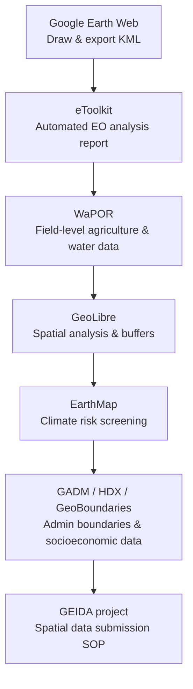

# Afternoon — Group Presentations & Closing

**Day 4 · 13:30–16:00 · Module 5**

---

## Group Presentations on Case-Study Findings *(13:30–15:00)*

  <iframe width="100%" height="400"
    src="https://www.youtube.com/embed/NX0-uz27qcE"
    title="Group discussion on case-study results — Day 4 afternoon"
    frameborder="0"
    allow="accelerometer; autoplay; clipboard-write; encrypted-media; gyroscope; picture-in-picture"
    allowfullscreen>
  </iframe>

---

Groups presented their case-study maps, eToolkit outputs, and climate risk analyses. Below are key themes and illustrative examples from the session.

### Illustrative example — road project analysis

One group presented an analysis of an IsDB-financed road reconstruction project:

**What they did:**

- Mapped the road corridor with start and end coordinates
- Drew a 1 km buffer around the financed road section
- Generated an eToolkit analysis for the corridor: LULC, vegetation trend, climate projections
- Used the AI-generated recommendation from eToolkit as a starting point for design considerations

**Their findings:**

- Temperature trend in the region is upward (eToolkit climate data)
- Precipitation is variable — no uniform increase or decrease observed
- Dominant land cover: grasslands — noted as potentially vulnerable to erosion at road embankments under increased rainfall
- Asphalt surfaces may accelerate soil erosion at embankment edges in high-rainfall events

**Their recommendation summary:**

Climate-adaptive infrastructure design to address flood and erosion risks: wider culverts, erosion-resistant embankment design.

### Common feedback themes from all groups

| Theme | Guidance |
|---|---|
| Map layout | The legend should not cover the study area; leave clear space so the project boundary remains fully visible |
| AI-generated text | The quantitative values (temperature change, precipitation variability) are derived from satellite and climate model data; the AI writes the interpretation text based on those values. Review recommendations against the underlying data and project context before use in formal documents |
| GeoLibre for road corridors | A buffer combined with a population raster allows preliminary beneficiary estimation |
| Climate projections | Specific projected values in the report come from processed satellite and climate model data — cite the data source and time period, not just the number |
| EarthMap | Best for national and basin-scale risk overview; combine with eToolkit for site-level quantitative detail |

---

## Wrap-up, Lessons Learned & Way Forward *(15:00–15:30)*

### Key messages from the closing session

- **Foundation is the starting point.** The Advanced level will go deeper into project-specific analysis, additional tools, and more complex indicators.
- **Register projects spatially from PCN stage.** The Minimum Project Data Submission Form initiates the GEIDA standard operating procedure — spatial data collection should begin at project identification.
- **Web tools are a starting point, not a ceiling.** eToolkit, WaPOR, GeoLibre, and EarthMap are well-suited for Foundation-level work. Participants who wish to go further: QGIS is free, open-source, and the natural next step.
- **Regional GEIDA Meetings** are planned — use the Regional Meeting Nomination Form to participate.

### What the Foundation course covered

Over four days, participants worked through the following tool sequence:

All exercises were completed in the browser. No desktop software or programming was required.

---

## Closing Remarks & Certificate Distribution *(15:30–16:00)*

  <iframe width="100%" height="400"
    src="https://www.youtube.com/embed/W3TiYI05k9I"
    title="GEIDA Foundation Training — Closing session"
    frameborder="0"
    allow="accelerometer; autoplay; clipboard-write; encrypted-media; gyroscope; picture-in-picture"
    allowfullscreen>
  </iframe>

The CCD/STI coordination team delivered the closing remarks, encouraging participants to apply the skills in their next project document and to support colleagues in their departments.

**Next steps:**

- Advanced Level training — follow-on from Foundation
- Regional GEIDA Meetings — nomination forms to be submitted
- GEIDA platform development continues — participant feedback and use-case forms will inform the next development phase
- Foundation Level Certificates distributed to all participants who completed the four days

!!! success "Congratulations to all Batch 1 participants"
    Apply the Foundation skills in your next PCN or PAD. Every project has a location — the GEIDA tools provide a structured way to work with it.

---

*Return to [Home](../index.md) · View [Resources & Tutorials](../resources/index.md)*
